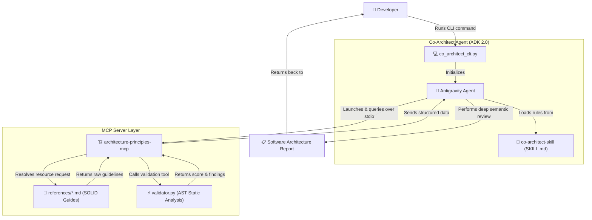

# 🏗️ Autonomous Co-Architect: Automated Software Design Reviewer 🤖📐

An agentic software architecture evaluation ecosystem designed to inspect, grade, and refactor Python codebases against design principles (such as **SOLID**). 

The ecosystem leverages the **Antigravity SDK 2.0 (ADK 2.0)** to create a CLI-based Senior Software Architect agent. This agent seamlessly orchestrates custom local **Skills** (for semantic grading and report layouts) and a **Model Context Protocol (MCP)** server (for fast AST-based rule checks and dynamic Markdown design reference retrieval).

---

## 🌌 System Architecture & Workflow

The system decomposes concerns into a clear, decoupled architecture. High-level domain analysis is conducted by the agent, while fast, rule-based static validation and dynamic documentation lookup are delegated to the MCP server.



---

## 📁 Repository Structure

```directory
Autonomous Co-Architect/
├── README.md                                  # <-- You are here (Central master guide)
│
├── architecture-principles-mcp/               # Python-based FastMCP Server
│   ├── src/
│   │   └── server.py                          # Server entry point exposing resources & tools
│   ├── references/                            # SOLID Principle Markdown guides
│   │   ├── SingleResponsibility.md
│   │   ├── DependencyInversion.md
│   │   └── ... (OCP, LSP, ISP)
│   ├── tests/
│   │   ├── validator.py                       # Core AST static analysis rule checks
│   │   ├── test_validator.py                  # Unit tests for the AST validator
│   │   └── test_server.py                     # Unit tests for the FastMCP endpoints
│   ├── pyproject.toml
│   └── requirements.txt
│
└── co-architect-agent/                        # CLI Agent (Antigravity SDK 2.0)
    ├── .agents/
    │   └── skills/
    │       └── co-architect-skill/
    │           └── SKILL.md                   # Grading system, severities, and report formatting
    ├── eval-app/
    │   └── order_processing.py                # Target Python file containing deliberate SOLID violations
    ├── co_architect_cli.py                    # Main executable SDK 2.0 agent wrapper
    ├── .env.example
    └── README.md
```

---

## ⚡ Quick Start

### 1. Configure Credentials
Create a `.env` file inside the `co-architect-agent/` directory:
```bash
cp co-architect-agent/.env.example co-architect-agent/.env
```
Open `co-architect-agent/.env` and paste your Google Gemini API key:
```env
GEMINI_API_KEY=your_actual_api_key_here
```

### 2. Set Up the MCP Server Virtual Environment
Navigate to the MCP server folder, set up its virtual environment, and install core and test dependencies:
```bash
cd architecture-principles-mcp
python3 -m venv .venv
source .venv/bin/activate
pip install -r requirements.txt
pip install ".[dev]"
```

Verify that the local validation and server test suite succeeds (13/13 tests):
```bash
python3 -m pytest tests/
deactivate
cd ..
```

### 3. Run the Evaluation Agent
Navigate to the agent directory and execute the CLI to review the target file [order_processing.py](file:///Users/raja/appdev/Autonomous%20Co-Architect/co-architect-agent/eval-app/order_processing.py):
```bash
cd co-architect-agent
./co_architect_cli.py --file ./eval-app/order_processing.py
```

The agent will stream its review token-by-token in your terminal and generate a beautiful, comprehensive markdown report detailing its findings.

---

## 🛠️ Detailed Component Insights

### 1. The MCP Server (`architecture-principles-mcp`)
A standard Model Context Protocol server exposing a clean API to any connected client (the ADK 2.0 agent, Claude Desktop, Cursor, or Windsurf):
* **Resources**:
  * `principles://{principle_name}`: Yields raw, extensive Markdown guidelines of a requested design principle.
* **Tools**:
  * `list_principles()`: Dynamically parses headers from markdown files inside `references/` and returns summaries.
  * `get_principle(name)`: Retrieves the documentation text.
  * `validate_code(code, principle)`: Invokes the fast **AST parser** (`validator.py`) to run static heuristic rules:
    * **SRP (Single Responsibility)**: Checks if class lengths exceed 150 lines, method counts exceed 7, or if name suffixes use generic catch-alls like `Manager`, `Helper`, or `Utility`.
    * **DIP (Dependency Inversion)**: Scans class constructors (`__init__`) and method bodies for direct inline instantiation of concrete custom classes, promoting Dependency Injection (DI) instead.

### 2. The Custom Skill (`co-architect-skill`)
A local agentic skill defined in [SKILL.md](file:///Users/raja/appdev/Autonomous%20Co-Architect/co-architect-agent/.agents/skills/co-architect-skill/SKILL.md). This file acts as the agent's brain for evaluation layout and classification:
* Defines **Severity Levels**:
  * 🚨 **Severe**: Major structural issues (like hardcoded concrete constructors) that block test isolation.
  * 🟠 **High**: Red flags (like catch-all names combined with high method counts) risking regression.
  * 🟡 **Medium**: Minor architectural smells (large classes approaching boundaries or missing abstractions).
  * 🟢 **Low**: Basic styling issues (missing type hints or missing docstrings).
* Sets the **Executive Reporting Layout**: Standardizes formatting with executive summaries, metrics tables, detailed before/after comparison code carousels, and prioritization Gantt charts.

### 3. The CLI Agent Executor (`co_architect_cli.py`)
Directly instantiates a local agent session utilizing the Antigravity SDK:
```python
config = LocalAgentConfig(
    api_key=os.environ.get("GEMINI_API_KEY"),
    system_instructions="...",
    capabilities=CapabilitiesConfig(),
    mcp_servers=[mcp_server],          # Starts architecture-principles-mcp on stdio
    skills_paths=[SKILLS_DIR],          # Loads local co-architect-skill
    model="gemini-3.5-flash"            # Modern standard model
)
```

---

## 🔍 Example Evaluation Report Output
Running the evaluation on `eval-app/order_processing.py` parses a class with multiple SOLID violations:
```python
class UserManager:
    def __init__(self):
        self.db = DatabaseClient()  # DIP Violation: concrete dependency
        self.mailer = SMTPMailer()  # DIP Violation
```

And outputs a structured premium markdown review detailing:
1. **Executive Summary**: Scoring compliance, highlighting god classes, and detailing cohesion drifts.
2. **Tabular Severity Breakdown**: Organizing findings logically.
3. **Interactive Code Carousel Findings**: Side-by-side Before/After refactored blocks.
4. **Implementation Gantt Timeline**: Standard prioritizations to refactor the code incrementally.

---

## 🧪 Testing the Ecosystem
You can run the test suite for the server and AST validator directly under the `architecture-principles-mcp/` directory:
```bash
python3 -m pytest tests/
```
All **13 tests pass successfully**, validating syntax error handling, AST violation detection, conforming class rules, and FastMCP resource endpoints.
